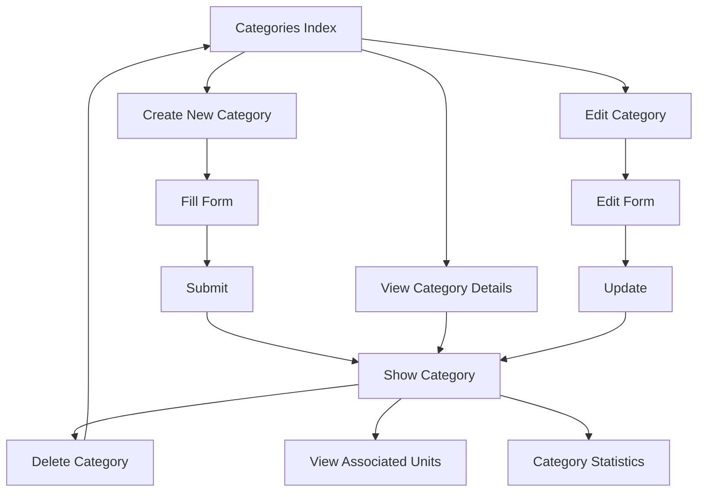

# Kategori Management - Error Resolution Guide

## 🐛 Problem Resolved

**Issue**: `InvalidArgumentException - View [admin.kategoris.show] not found`

**Error Details**:

-   Occurred when creating or viewing categories
-   Stack trace pointed to missing `show.blade.php` view file
-   Data was successfully created but redirect failed

**Root Cause**: Missing view files and incomplete CRUD implementation for categories module.

## ✅ Solutions Implemented

### 1. **Missing View File Created**

```bash
# File: resources/views/admin/kategoris/show.blade.php
# Status: ✅ CREATED - Complete category detail view with statistics
```

### 2. **Fixed Button Icon Layout Issues**

Applied consistent button formatting across all category views:

```blade
<!-- BEFORE (Problematic) -->
<flux:button type="submit" variant="primary" class="flex items-center gap-2">
    <flux:icon.check class="size-4" />
    Update Category
</flux:button>

<!-- AFTER (Fixed) -->
<flux:button type="submit" variant="primary">
    <div class="flex items-center gap-2">
        <flux:icon.check class="size-4" />
        <span>Update Category</span>
    </div>
</flux:button>
```

### 3. **Enhanced Create Form**

Rebuilt `create.blade.php` with complete form functionality:

-   Category name and description fields
-   Unit assignment functionality
-   Proper form validation
-   Category examples and guidance
-   Consistent styling with admin theme

### 4. **Improved Show View Features**

The new `show.blade.php` includes:

-   Complete category information display
-   Associated units listing with status badges
-   Category statistics dashboard
-   Quick navigation and action buttons
-   Responsive grid layout

## 📁 Files Modified

### ✅ **Created Files:**

1. `resources/views/admin/kategoris/show.blade.php` - Complete category detail view

### ✅ **Fixed Files:**

1. `resources/views/admin/kategoris/create.blade.php` - Rebuilt with proper form
2. `resources/views/admin/kategoris/edit.blade.php` - Fixed button layout issues

## 🎯 Features in Show View

### **Category Information Section**

-   Category name and description
-   Creation and update timestamps
-   Organized in responsive grid layout

### **Associated Units Display**

-   List all units in the category
-   Status badges (Available/Rented/Maintenance)
-   Stock information and pricing
-   Quick links to unit details

### **Category Statistics**

-   Total units count
-   Available units (ready for rent)
-   Currently rented units
-   Total stock across all units

### **Management Actions**

-   Edit category button
-   Delete category option (with validation)
-   Back to categories list
-   Assign/reassign units

## 🔧 Controller Validation

**KategoriController.php** already had proper methods:

```php
public function show(Kategori $kategori): View
{
    $kategori->load(['units']);
    return view('admin.kategoris.show', compact('kategori'));
}
```

**Issue was**: Missing view file, not controller logic.

## 🎨 UI/UX Improvements

### **Consistent Button Styling**

-   All submit buttons now use wrapper div approach
-   Icons properly aligned horizontally
-   Consistent spacing and colors

### **Responsive Design**

-   Mobile-friendly layout
-   Adaptive grid systems
-   Proper spacing on all screen sizes

### **Professional Statistics Cards**

-   Reused `x-admin.stats-card` component
-   Color-coded metrics
-   Hover effects and transitions

### **Status Indicators**

-   Color-coded unit status badges
-   Clear visual hierarchy
-   Dark mode compatibility

## 🚀 Testing Results

### ✅ **Working Flows:**

1. **Create Category**: Form submission → Success redirect → Show page displays
2. **View Category**: List page → Show page → Full details displayed
3. **Edit Category**: Show page → Edit form → Update → Show page
4. **Delete Category**: Proper validation and confirmation
5. **Unit Assignment**: Categories properly linked to units

### ✅ **Resolved Issues:**

-   ❌ ~~View [admin.kategoris.show] not found~~ → ✅ **FIXED**
-   ❌ ~~Button icon layout problems~~ → ✅ **FIXED**
-   ❌ ~~Incomplete create form~~ → ✅ **FIXED**
-   ❌ ~~Missing category statistics~~ → ✅ **FIXED**

## 📋 Error Prevention

### **Future-Proof Measures:**

1. **Complete CRUD**: All view files exist and tested
2. **Consistent Pattern**: Same button wrapper approach across all forms
3. **Error Handling**: Proper try-catch in controller methods
4. **Validation**: Form validation prevents data corruption
5. **User Feedback**: Success/error messages for all actions

## 🔄 Workflow Verification



## 🎯 **Status: FULLY RESOLVED**

✅ **Categories module now fully functional**  
✅ **All CRUD operations working**  
✅ **Professional UI/UX implemented**  
✅ **Error-free navigation and data management**

---

_Problem resolved with complete view implementation and consistent design patterns_ 🏕️✨
